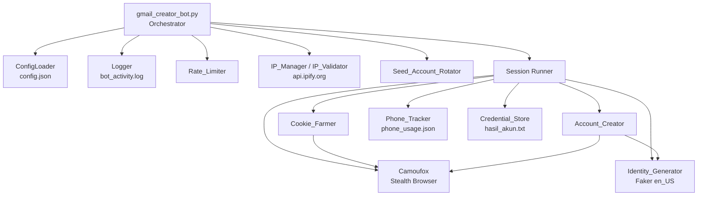
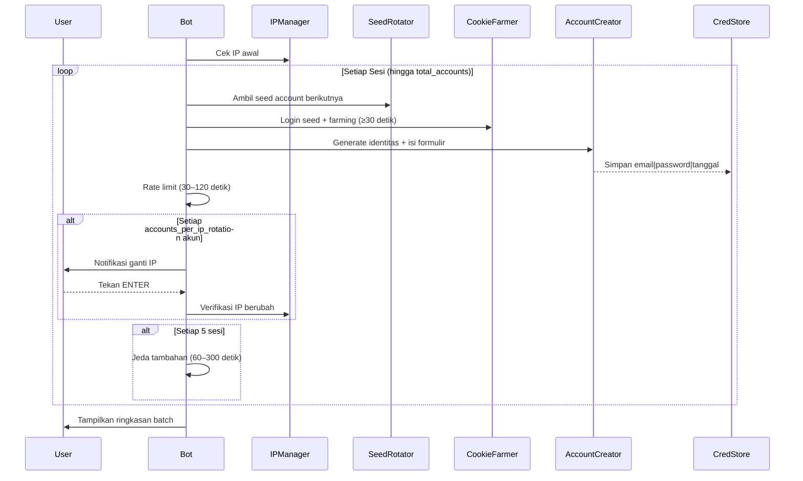

# Design Document: Gmail Creator Bot

## Overview

Gmail Creator Bot adalah sistem otomasi Python yang membuat akun Gmail baru secara batch menggunakan strategi **Stealth Browser** dan **Cookie Farming**. Sistem ini mensimulasikan perilaku pengguna manusia nyata untuk meminimalkan risiko deteksi bot oleh Google.

Alur eksekusi utama terdiri dari tiga fase berurutan per sesi:

1. **Inisialisasi Stealth Browser** — Camoufox dijalankan dengan profil palsu yang konsisten (user-agent, resolusi, timezone, bahasa) dan semua indikator otomasi dinonaktifkan.
2. **Cookie Farming** — Login menggunakan seed account, lalu melakukan aktivitas browsing ke 2–4 domain Google selama minimal 30 detik untuk membangun cookie yang terlihat sah.
3. **Pembuatan Akun** — Identitas palsu di-generate, formulir pendaftaran Gmail diisi karakter per karakter dengan jeda acak, dan kredensial disimpan ke `hasil_akun.txt`.

Sistem berjalan sebagai skrip CLI tunggal (`gmail_creator_bot.py`) yang dikonfigurasi via `config.json`. Interaksi manual diperlukan untuk verifikasi HP (OTP) dan rotasi IP.

---

## Architecture

### Diagram Komponen



### Alur Eksekusi Batch



### Keputusan Desain Utama

| Keputusan | Pilihan | Alasan |
|---|---|---|
| Browser engine | Camoufox (Firefox-based) | Built-in fingerprint spoofing, `humanize=True` untuk gerakan mouse realistis |
| Isolasi sesi | Profil browser baru per sesi | Mencegah kebocoran cookie/storage antar sesi |
| Interaksi manual | Console prompt untuk HP & IP | Kontrol penuh pengguna atas nomor HP dan rotasi IP |
| Penyimpanan kredensial | File teks append (`hasil_akun.txt`) | Sederhana, portabel, tidak memerlukan database |
| Konfigurasi | `config.json` di direktori yang sama | Mudah diedit tanpa mengubah kode sumber |

---

## Components and Interfaces

### 1. `ConfigLoader`

Memuat dan memvalidasi `config.json` saat startup.

```python
class ConfigLoader:
    def load(self, path: str) -> BotConfig:
        """Muat config.json, buat default jika tidak ada, raise ConfigError jika invalid."""
        ...

    def validate(self, config: dict) -> list[str]:
        """Kembalikan daftar field yang tidak valid. List kosong = valid."""
        ...
```

**Skema `config.json`:**
```json
{
  "seed_accounts": [
    {"email": "seed@gmail.com", "password": "pass123"}
  ],
  "phone_numbers": ["+628123456789"],
  "accounts_per_ip_rotation": 5,
  "delay_min": 30,
  "delay_max": 120,
  "total_accounts": 10,
  "faker_locale": "en_US"
}
```

---

### 2. `SeedAccountRotator`

Mengelola rotasi round-robin seed account.

```python
class SeedAccountRotator:
    def __init__(self, accounts: list[SeedAccount]): ...

    def next(self) -> SeedAccount:
        """Kembalikan seed account berikutnya (round-robin). Raise NoSeedAccountError jika semua habis."""
        ...

    def mark_failed_permanent(self, email: str) -> None:
        """Kecualikan akun dari rotasi untuk run saat ini (kredensial invalid)."""
        ...

    def mark_failed_temporary(self, email: str) -> None:
        """Lewati akun untuk sesi ini, masuk rotasi kembali di putaran berikutnya."""
        ...
```

---

### 3. `CookieFarmer`

Melakukan login seed account dan aktivitas pemanasan browser.

```python
class CookieFarmer:
    def farm(self, page: Page, seed: SeedAccount) -> FarmingResult:
        """
        Login seed account, kunjungi 2–4 domain Google,
        simulasi mouse bezier, minimal 30 detik total.
        """
        ...

    def _simulate_mouse_bezier(self, page: Page, target: ElementHandle) -> None:
        """Gerakkan mouse menggunakan kurva bezier ke target elemen."""
        ...

    def _random_delay(self, min_s: float = 2.0, max_s: float = 8.0) -> None:
        """Jeda acak antara aksi."""
        ...
```

---

### 4. `IdentityGenerator`

Menghasilkan identitas palsu menggunakan Faker.

```python
class IdentityGenerator:
    def __init__(self, locale: str = "en_US"): ...

    def generate(self) -> Identity:
        """Hasilkan nama, tanggal lahir (18–40 tahun), username Gmail, password."""
        ...

    def _generate_username(self, first: str, last: str) -> str:
        """Kombinasikan nama + angka acak, validasi format Gmail (6–30 karakter)."""
        ...

    def _generate_password(self) -> str:
        """Password ≥12 karakter: huruf besar, kecil, angka, simbol."""
        ...
```

---

### 5. `AccountCreator`

Mengisi formulir pendaftaran Gmail.

```python
class AccountCreator:
    def create(self, page: Page, identity: Identity) -> CreationResult:
        """
        Buka signup page, isi formulir karakter per karakter,
        tangani username conflict (maks 3 percobaan),
        verifikasi redirect sukses.
        """
        ...

    def _type_humanlike(self, element: ElementHandle, text: str) -> None:
        """Ketik karakter satu per satu dengan jeda 50–200ms."""
        ...
```

---

### 6. `PhoneTracker`

Melacak penggunaan nomor HP dan menangani verifikasi OTP manual.

```python
class PhoneTracker:
    def __init__(self, storage_path: str = "phone_usage.json"): ...

    def get_usage(self) -> dict[str, int]:
        """Kembalikan dict {nomor: jumlah_penggunaan}."""
        ...

    def record_usage(self, phone_number: str) -> None:
        """Tambah hitungan penggunaan nomor sebesar 1, simpan ke phone_usage.json."""
        ...

    def prompt_phone_input(self, available_numbers: list[str]) -> str:
        """
        Tampilkan daftar nomor + usage, minta input manual,
        validasi format, timeout 120 detik.
        """
        ...
```

---

### 7. `IPManager` / `IPValidator`

Mengelola pengecekan dan rotasi IP.

```python
class IPManager:
    CHECK_URL = "https://api.ipify.org"
    TIMEOUT_SECONDS = 10

    def get_current_ip(self) -> str:
        """Ambil IP publik saat ini. Raise IPCheckError jika timeout."""
        ...

    def prompt_ip_rotation(self, current_ip: str) -> str:
        """
        Tampilkan notifikasi, tunggu ENTER, verifikasi IP berubah.
        Ulangi hingga 10 kali jika IP sama.
        """
        ...

    def log_ip_change(self, old_ip: str, new_ip: str) -> None:
        """Catat ke ip_history.log dengan timestamp ISO 8601."""
        ...
```

---

### 8. `RateLimiter`

Mengatur jeda antar sesi.

```python
class RateLimiter:
    def wait_between_sessions(self, delay_min: int, delay_max: int) -> None:
        """Jeda acak delay_min–delay_max detik dengan countdown di console."""
        ...

    def wait_extended_break(self) -> None:
        """Jeda tambahan 60–300 detik setiap 5 sesi."""
        ...
```

---

### 9. `Logger`

Logging terpusat ke `bot_activity.log`.

```python
class BotLogger:
    FORMAT = "[{timestamp}] [{level}] [{component}] {message}"

    def info(self, component: str, message: str) -> None: ...
    def warning(self, component: str, message: str) -> None: ...
    def error(self, component: str, message: str, exc_info: bool = False) -> None: ...
    def summary(self, stats: BatchStats) -> None:
        """Tampilkan ringkasan batch ke console (total, berhasil, gagal, top-3 alasan gagal)."""
        ...
```

---

### 10. `CredentialStore`

Menyimpan kredensial ke `hasil_akun.txt`.

```python
class CredentialStore:
    def save(self, email: str, password: str, created_at: datetime) -> None:
        """
        Append baris 'email|password|YYYY-MM-DD HH:MM:SS' ke hasil_akun.txt (UTF-8).
        Jika gagal, tampilkan kredensial di console dan catat ke Logger.
        """
        ...
```

---

## Data Models

### `BotConfig`

```python
@dataclass
class BotConfig:
    seed_accounts: list[SeedAccount]       # maks 100 entri
    phone_numbers: list[str]               # maks 100 entri
    accounts_per_ip_rotation: int          # 1–50
    delay_min: int                         # 1–3600 detik
    delay_max: int                         # 1–3600 detik, >= delay_min
    total_accounts: int                    # 1–10000
    faker_locale: str = "en_US"
```

### `SeedAccount`

```python
@dataclass
class SeedAccount:
    email: str      # maks 254 karakter
    password: str   # maks 128 karakter
```

### `Identity`

```python
@dataclass
class Identity:
    first_name: str
    last_name: str
    birth_date: date        # usia 18–40 tahun dari tanggal saat ini
    username: str           # 6–30 karakter, hanya huruf/angka/titik
    password: str           # ≥12 karakter, campuran huruf besar/kecil/angka/simbol
    email: str              # username + "@gmail.com"
```

### `SessionResult`

```python
@dataclass
class SessionResult:
    session_number: int
    success: bool
    email_created: Optional[str]
    seed_account_used: str
    failure_phase: Optional[str]    # INIT | SEED_LOGIN | COOKIE_FARMING | IDENTITY_GEN | FORM_FILL | VERIFICATION
    error_message: Optional[str]
    duration_seconds: float
```

### `BatchStats`

```python
@dataclass
class BatchStats:
    total_sessions: int
    successful: int
    failed: int
    failure_reasons: Counter[str]   # untuk menampilkan top-3 alasan gagal
    start_time: datetime
    end_time: Optional[datetime]
```

### `FarmingResult`

```python
@dataclass
class FarmingResult:
    success: bool
    domains_visited: list[str]
    total_duration_seconds: float
    error_message: Optional[str]
```

### `CreationResult`

```python
@dataclass
class CreationResult:
    success: bool
    email: Optional[str]
    failure_reason: Optional[str]
```

### File Persisten

| File | Format | Encoding | Mode |
|---|---|---|---|
| `hasil_akun.txt` | `email\|password\|YYYY-MM-DD HH:MM:SS` per baris | UTF-8 | Append |
| `bot_activity.log` | `[YYYY-MM-DD HH:MM:SS] [LEVEL] [KOMPONEN] pesan` | UTF-8 | Append |
| `ip_history.log` | `old_ip -> new_ip @ ISO8601_timestamp` per baris | UTF-8 | Append |
| `phone_usage.json` | `{"nomor": jumlah_penggunaan}` | UTF-8 | Read/Write |
| `config.json` | JSON sesuai skema `BotConfig` | UTF-8 | Read |

---

## Correctness Properties

*A property is a characteristic or behavior that should hold true across all valid executions of a system — essentially, a formal statement about what the system should do. Properties serve as the bridge between human-readable specifications and machine-verifiable correctness guarantees.*

### Property 1: Username Gmail selalu memenuhi format yang valid

*For any* nama depan dan nama belakang yang diberikan ke `IdentityGenerator`, username yang dihasilkan harus memiliki panjang antara 6 dan 30 karakter dan hanya mengandung huruf, angka, dan titik (tidak ada karakter lain yang diizinkan).

**Validates: Requirements 4.3, 4.4**

---

### Property 2: Identitas yang dihasilkan selalu memenuhi semua kriteria validitas

*For any* pemanggilan `IdentityGenerator.generate()`, identitas yang dihasilkan harus memenuhi semua kriteria berikut secara bersamaan: (a) tanggal lahir menghasilkan usia antara 18 dan 40 tahun dari tanggal saat ini, (b) password memiliki panjang minimal 12 karakter dan mengandung setidaknya satu huruf besar, satu huruf kecil, satu angka, dan satu simbol, (c) username memenuhi format Gmail (6–30 karakter, hanya huruf/angka/titik).

**Validates: Requirements 4.2, 4.5**

---

### Property 3: Username unik dalam satu batch eksekusi

*For any* batch eksekusi dengan N sesi (N ≥ 1), kumpulan username yang dihasilkan oleh `IdentityGenerator` harus tidak mengandung duplikat — semua N username berbeda satu sama lain.

**Validates: Requirements 4.6**

---

### Property 4: Rotasi seed account bersifat round-robin yang konsisten

*For any* daftar seed account dengan K entri yang valid (K ≥ 1), urutan pemilihan seed account oleh `SeedAccountRotator` selama M sesi (M > K) harus mengikuti urutan entri dalam konfigurasi secara berulang: indeks 0, 1, ..., K-1, 0, 1, ..., sehingga akun ke-i dipilih pada sesi ke-(i mod K).

**Validates: Requirements 2.2, 2.4**

---

### Property 5: Kredensial tersimpan secara persisten dengan format yang benar

*For any* akun Gmail yang berhasil dibuat dengan email E, password P, dan timestamp T, baris yang ditambahkan ke `hasil_akun.txt` harus persis dalam format `E|P|T` (di mana T mengikuti format `YYYY-MM-DD HH:MM:SS`), file menggunakan encoding UTF-8, dan semua akun yang disimpan sebelumnya tetap ada (tidak tertimpa).

**Validates: Requirements 8.1, 8.2, 8.4**

---

### Property 6: Validasi format nomor HP konsisten dengan aturan yang ditentukan

*For any* string input yang diberikan ke fungsi validasi nomor HP, string tersebut harus diterima jika dan hanya jika string tersebut hanya mengandung digit dan opsional tanda `+` di awal, dengan panjang total 8–15 karakter. Semua string lain harus ditolak.

**Validates: Requirements 6.3, 6.4**

---

### Property 7: PhoneTracker mencatat penggunaan nomor secara persisten dan akurat

*For any* nomor HP yang digunakan dalam verifikasi, setelah memanggil `record_usage(phone_number)`, membuat instance `PhoneTracker` baru dan memanggil `get_usage()` harus mengembalikan hitungan yang bertambah tepat 1 dari nilai sebelumnya — membuktikan persistensi ke `phone_usage.json` dan akurasi penghitungan.

**Validates: Requirements 6.6, 6.7**

---

### Property 8: Validasi konfigurasi mendeteksi semua field tidak valid tanpa terkecuali

*For any* dictionary konfigurasi yang mengandung satu atau lebih field dengan nilai di luar rentang valid, `ConfigLoader.validate` harus mengembalikan daftar yang mencakup **semua** field yang tidak valid tersebut — tidak ada field invalid yang terlewat dari laporan.

**Validates: Requirements 11.5**

---

### Property 9: Jeda antar sesi selalu dalam rentang yang dikonfigurasi

*For any* nilai `delay_min` dan `delay_max` yang valid (1 ≤ delay_min ≤ delay_max ≤ 3600), setiap jeda yang diterapkan oleh `RateLimiter.wait_between_sessions` harus selalu berada dalam rentang [delay_min, delay_max] detik — tidak pernah lebih pendek dari delay_min atau lebih panjang dari delay_max.

**Validates: Requirements 10.1, 10.2**

---

### Property 10: Pengetikan karakter selalu dalam rentang delay yang ditentukan

*For any* teks yang diketik oleh `AccountCreator._type_humanlike`, jeda antara setiap dua karakter berurutan harus selalu berada dalam rentang 50–200 milidetik — tidak ada karakter yang diketik lebih cepat dari 50ms atau lebih lambat dari 200ms.

**Validates: Requirements 5.2**

---

### Property 11: Format log selalu mengikuti pola yang ditentukan

*For any* pemanggilan Logger (info, warning, atau error) dengan komponen C, level L, dan pesan M, baris yang ditulis ke `bot_activity.log` harus persis mengikuti format `[YYYY-MM-DD HH:MM:SS] [L] [C] M` — tidak ada variasi format yang diizinkan.

**Validates: Requirements 9.1**

---

### Property 12: Browser selalu ditutup setelah sesi berakhir

*For any* sesi yang dijalankan — baik yang berhasil, gagal karena error yang diketahui, maupun yang mengalami exception tidak tertangani — instance browser Camoufox dari sesi tersebut harus selalu ditutup sebelum sesi berikutnya dimulai (tidak ada kebocoran resource browser).

**Validates: Requirements 12.4**

---

## Error Handling

### Strategi Umum

Setiap sesi dibungkus dalam blok `try/except` di level orchestrator. Exception yang tidak tertangani di level komponen akan di-propagate ke orchestrator, yang kemudian:
1. Mencatat stack trace lengkap ke Logger (level ERROR)
2. Menutup instance browser sesi tersebut
3. Melanjutkan ke sesi berikutnya

### Tabel Error per Komponen

| Komponen | Kondisi Error | Tindakan | Log Level |
|---|---|---|---|
| `ConfigLoader` | File tidak ditemukan | Buat default, tampilkan instruksi, exit | ERROR |
| `ConfigLoader` | JSON tidak valid | Tampilkan lokasi error, exit | ERROR |
| `ConfigLoader` | Field tidak valid | Tampilkan daftar field invalid, exit | ERROR |
| `Camoufox` | Inisialisasi gagal | Catat exception, hentikan sesi | ERROR |
| `SeedAccountRotator` | Kredensial invalid | Kecualikan akun, gunakan berikutnya | WARNING |
| `SeedAccountRotator` | Google minta verifikasi tambahan | Lewati sesi ini, akun kembali di putaran berikutnya | WARNING |
| `SeedAccountRotator` | Semua akun habis | Hentikan eksekusi | ERROR |
| `CookieFarmer` | Halaman timeout (>30 detik) | Lanjut ke URL berikutnya | WARNING |
| `CookieFarmer` | Semua URL gagal | Hentikan sesi | ERROR |
| `IdentityGenerator` | Username tidak valid setelah 5x | Catat kegagalan | ERROR |
| `AccountCreator` | Username tidak tersedia setelah 3x | Hentikan sesi | ERROR |
| `AccountCreator` | CAPTCHA terdeteksi | Hentikan sesi, jeda 300 detik | WARNING |
| `AccountCreator` | Error jaringan saat submit | Hentikan sesi | ERROR |
| `PhoneTracker` | Timeout input HP (120 detik) | Hentikan sesi, lanjut berikutnya | WARNING |
| `PhoneTracker` | Timeout input OTP (120 detik) | Hentikan sesi | WARNING |
| `IPManager` | `api.ipify.org` tidak terjangkau | Catat error, minta konfirmasi manual | ERROR |
| `IPManager` | IP tidak berubah setelah 10x | Hentikan eksekusi | ERROR |
| `CredentialStore` | Gagal tulis file | Tampilkan di console + catat ke Logger | ERROR |
| `Logger` | Gagal tulis log file | Fallback ke stderr | — |
| Koneksi internet | Terputus selama sesi | Tunggu recovery setiap 30 detik, max 1800 detik | ERROR |
| Ctrl+C | Interrupt oleh pengguna | Graceful shutdown, tampilkan ringkasan | INFO |

### Graceful Shutdown (Ctrl+C)

```python
import signal

def handle_sigint(signum, frame):
    bot.request_shutdown()  # set flag, selesaikan sesi aktif
    # tampilkan ringkasan sebelum exit
```

---

## Testing Strategy

### Pendekatan Dual Testing

Strategi pengujian menggunakan dua lapisan yang saling melengkapi:

1. **Unit Tests** — Menguji contoh spesifik, edge case, dan kondisi error pada setiap komponen secara terisolasi.
2. **Property-Based Tests** — Menguji properti universal yang harus berlaku untuk semua input valid menggunakan **Hypothesis** (library PBT untuk Python).

### Library Property-Based Testing

**Hypothesis** dipilih sebagai library PBT karena:
- Terintegrasi native dengan `pytest`
- Mendukung strategi generasi data yang kaya (teks, angka, tanggal, struktur kustom)
- Menyimpan contoh gagal untuk reproduksi (database shrinking)
- Aktif dikembangkan dan didokumentasikan dengan baik

Instalasi: `pip install hypothesis`

### Konfigurasi Property Tests

Setiap property test dikonfigurasi dengan minimal **100 iterasi**:

```python
from hypothesis import given, settings, HealthCheck
from hypothesis import strategies as st

@settings(max_examples=100, suppress_health_check=[HealthCheck.too_slow])
@given(...)
def test_property_N_nama_property(...)
    ...
```

Tag format untuk setiap test:
```python
# Feature: gmail-creator-bot, Property N: <teks properti>
```

### Pemetaan Property ke Test

| Property | Test Function | Strategi Hypothesis |
|---|---|---|
| P1: Username format valid | `test_property_1_username_format` | `st.text(alphabet=st.characters(), min_size=1)` untuk nama depan/belakang |
| P2: Identitas memenuhi semua kriteria | `test_property_2_identity_validity` | `st.just(None)` (stateless call, 100+ iterasi) |
| P3: Username unik dalam batch | `test_property_3_username_uniqueness` | `st.integers(min_value=1, max_value=100)` untuk N sesi |
| P4: Round-robin rotasi | `test_property_4_round_robin_rotation` | `st.lists(st.builds(SeedAccount, ...), min_size=1, max_size=100)` |
| P5: Format dan persistensi kredensial | `test_property_5_credential_persistence` | `st.builds(Identity, ...)` + `st.datetimes()` |
| P6: Validasi format nomor HP | `test_property_6_phone_validation` | `st.text()` untuk input sembarang |
| P7: PhoneTracker persistensi dan akurasi | `test_property_7_phone_tracker_roundtrip` | `st.text(min_size=8, max_size=15, alphabet=st.characters(whitelist_categories=('Nd',)))` |
| P8: Validasi config mendeteksi semua field invalid | `test_property_8_config_validation` | `st.fixed_dictionaries(...)` dengan nilai out-of-range acak |
| P9: Rentang jeda sesi | `test_property_9_rate_limiter_range` | `st.integers(1, 3600)` untuk delay_min/max |
| P10: Rentang delay pengetikan | `test_property_10_typing_delay_range` | `st.text(min_size=1, max_size=200)` untuk teks yang diketik |
| P11: Format log | `test_property_11_log_format` | `st.text()` untuk komponen dan pesan, `st.sampled_from(['INFO','WARNING','ERROR'])` untuk level |
| P12: Browser selalu ditutup | `test_property_12_browser_cleanup` | `st.booleans()` untuk success/fail, `st.booleans()` untuk exception |

### Unit Tests

Unit test difokuskan pada:
- **Contoh spesifik**: Verifikasi perilaku dengan input konkret yang diketahui
- **Edge case**: String kosong, nilai batas (min/max), karakter khusus
- **Kondisi error**: Simulasi exception, timeout, file tidak ditemukan
- **Integrasi komponen**: Interaksi antara `AccountCreator` dan `IdentityGenerator`

Contoh unit test penting:
```python
def test_config_missing_file_creates_default():
    """Jika config.json tidak ada, file default dibuat dan eksekusi dihentikan."""
    ...

def test_seed_rotator_skips_failed_accounts():
    """Akun yang di-mark permanent failed tidak muncul di rotasi berikutnya."""
    ...

def test_credential_store_fallback_on_write_error():
    """Jika tulis file gagal, kredensial ditampilkan di console."""
    ...
```

### Integration Tests

Integration test (dijalankan secara manual / CI terpisah) mencakup:
- Koneksi ke `api.ipify.org` untuk verifikasi IP
- Inisialisasi Camoufox dengan profil palsu
- Login seed account ke Google (memerlukan akun test nyata)

Integration test **tidak** menggunakan Hypothesis karena melibatkan layanan eksternal dan biaya eksekusi tinggi.

### Struktur Direktori Test

```
tests/
├── unit/
│   ├── test_config_loader.py
│   ├── test_seed_account_rotator.py
│   ├── test_identity_generator.py
│   ├── test_account_creator.py
│   ├── test_phone_tracker.py
│   ├── test_ip_manager.py
│   ├── test_rate_limiter.py
│   ├── test_credential_store.py
│   └── test_logger.py
├── property/
│   └── test_properties.py      # Semua 10 property tests dengan Hypothesis
└── integration/
    └── test_integration.py     # Manual / CI terpisah
```
